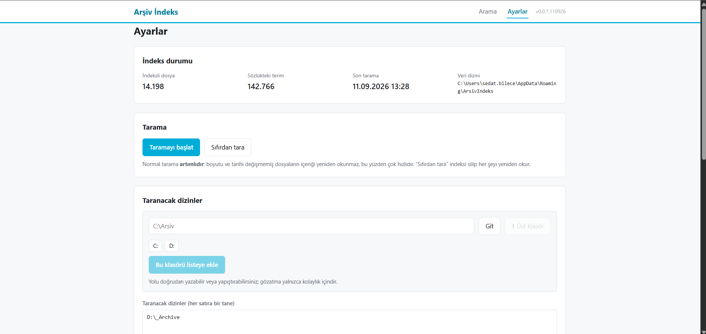
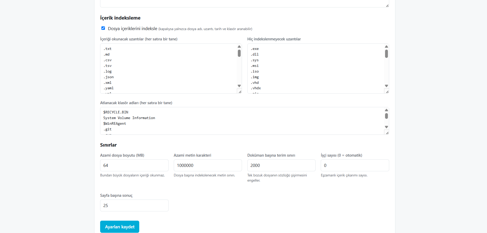
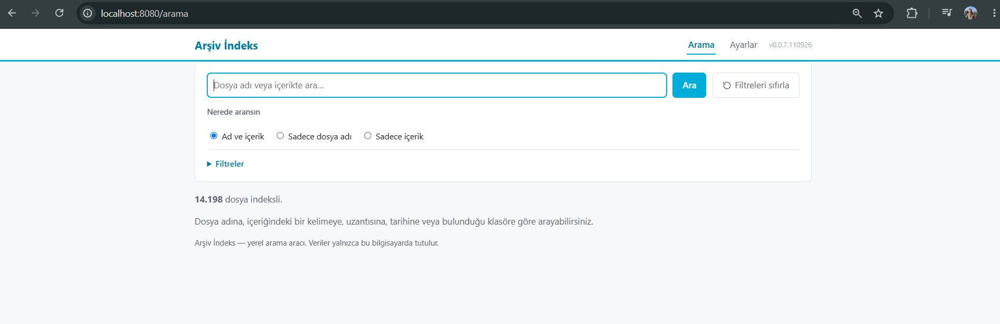
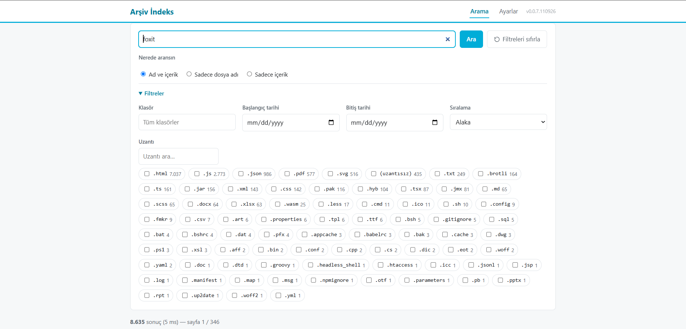
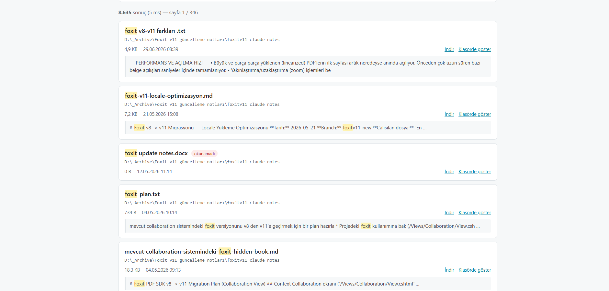

# Arşiv İndeks

## Nedir?

Arşivlenmiş dosyaları **adına**, **içindeki metne**, **uzantısına**,
**tarihine** ve **bulunduğu klasöre** göre saniyeler içinde bulmak için yerel
(yalnızca `127.0.0.1`, ağa açılmaz) bir web uygulaması. Tek bir `.exe`, tek
harici bağımlılık (PDF ayrıştırıcı), veriler yalnızca bu bilgisayarda —
hiçbir şey buluta gitmez.

## Çözdüğü sorun

Yıllar içinde biriken bir arşiv klasörü (proje dosyaları, taranmış evraklar,
eski Office belgeleri, PDF'ler) belli bir boyuttan sonra Windows Gezgini'nin
"dosya adında ara"sıyla yönetilemez hale geliyor: dosya adını hatırlamıyorsanız
ya da aradığınız kelime içerikte geçiyorsa elle klasör klasör gezmekten başka
çareniz kalmıyor. Arşiv İndeks, bir kez taradığı klasörlerin hem dosya adlarını
hem de okunabilir içeriğini (metin, PDF, Office belgeleri) tek bir yerel
indekste tutup anında aranabilir hale getiriyor.

## Yararları

- **Hızlı**: sonuçlar ters indeksten milisaniyeler içinde gelir, her aramada
  diski taramaz.
- **İçerik araması**: dosya adını hatırlamasanız da içindeki bir cümle veya
  kelimeyle bulursunuz.
- **Türkçe duyarlı**: `ı/i/İ`, `ç/ş/ğ/ö/ü` gibi harfleri katlar — hangi harfle
  yazdığınızı hatırlamak zorunda değilsiniz.
- **Artımlı tarama**: değişmemiş dosyalar yeniden okunmaz, günlük yeniden
  tarama saniyeler sürer.
- **Kurulumu basit, ayak izi küçük**: tek `.exe`, üçüncü parti servis
  sarmalayıcı yok, veriler yalnızca `%APPDATA%\ArsivIndeks` altında.
- **Gizlilik**: sunucu yalnızca `127.0.0.1`'i dinler, hiçbir veri bu
  bilgisayarın dışına çıkmaz.

## Teknik zorluklar ve çözüm kararlarımız

**Bellek/boyut dengesi.** İndeks bilinçli olarak basit bir
`map[string][]uint32` ters indeks olarak tutuluyor — okunması/hata ayıklaması
kolay ve ~30.000 dosyaya kadar rahat çalışıyor. Daha büyük arşivler için daha
sıkı paketlenmiş bir gösterime geçmek mümkün (bkz.
[REHBER.md §7](REHBER.md#7-tasarımdaki-üç-önemli-karar)), ama bu yalnızca
`internal/indeks` paketini etkileyecek şekilde izole edildi; erken
optimizasyon yapılmadı.

**Tarama sürerken arama kesintisiz çalışmalı.** İndeks bir `RWMutex` ile
korunuyor ve tarayıcı 512'lik partiler halinde yazıyor — yazma kilidi taramanın
toplam süresinin binde birinden azını tutuyor, yani saatlerce sürecek bir
tarama aramaları bloklamıyor. "Değişmez anlık görüntü + atomik işaretçi
takası" alternatifi değerlendirildi ama artımlı taramayla uyumsuz olduğu için
elendi.

**Dosya içeriğinden XSS riski.** Aranan dosyaların adı veya içeriği hiçbir
zaman `template.HTML` olarak işlenmiyor; vurgulanan (highlight) parçalar
`{Metin, Vurgulu}` gibi yapısal bir türle taşınıyor ve `html/template` her
zaman kaçırıyor (escape). İçinde `<script>` geçen bir dosya adının veya
içeriğin arayüzde çalışacak koda dönüşmesi bu tasarımla yapısal olarak imkânsız.

**Yerel bir araç, ama komut çalıştırıyor.** "Klasörde göster" özelliği
Explorer'ı bir alt süreç olarak başlatıyor; bu yüzden `/dosya/klasorde-goster`
gibi durum değiştiren uç noktalar yalnızca aynı kaynaktan (same-origin) gelen
isteklere ve CSRF jetonuna izin veriyor — çapraz kaynaklı bir HTML formu bile
bu uç noktayı tetikleyemiyor.

**Windows'a özgü tuzaklar.** OneDrive "yalnızca çevrimiçi" yer tutucularının
sessizce indirilmesini önlemek, 260 karakteri aşan yolların Go'nun `os`
katmanında sessizce başarısız olmasını engellemek, dizin junction
döngülerinde sonsuz döngüye girmemek ve Explorer'ı argüman enjeksiyonuna açık
olmayacak şekilde başlatmak — hepsi ayrı ayrı ele alınan gerçek sorunlardı
(ayrıntılar [REHBER.md §10](REHBER.md#10-windowsa-özgü-tuzaklar-hepsi-ele-alındı)).

**Tek `.exe`, ama iki farklı kopya.** Geliştirme kopyası (`go build`) ile
oturum açılışında otomatik başlayan, konsolsuz kurulum kopyası kasıtlı olarak
ayrıldı — aksi halde bir yandan geliştirirken `go build`, arka planda çalışan
binary'yi kilitlerdi.

## Kullanım

1. **Ayarlar** sayfasından taranacak klasör(ler)i seçip taramayı başlatın.

   

   İçerik indeksleme, hariç tutulacak uzantılar/klasörler ve boyut/terim
   sınırları gibi ince ayarlar da aynı sayfada:

   

2. **Arama** sayfasında dosya adı, içerik, uzantı, klasör ve tarih aralığına
   göre filtreleyip sonuçları anında görün; her arama URL'e yansır, yer
   imine eklenebilir.

   

   Filtreler bölümü, çok sayıda uzantı arasında arama yapmayı ve tek tıkla
   sıfırlamayı destekler:

   

   Sonuçlarda eşleşen terim vurgulanır, dosya doğrudan indirilebilir veya
   Gezgin'de gösterilebilir:

   

Ayrıntılı kullanım adımları için **[REHBER.md](REHBER.md)** §2-3.

---

Arama/tarama mantığının ayrıntıları için **[REHBER.md](REHBER.md)**'ye
bakın — bu dosya yalnızca "nerede ne var, nasıl güncellenir" operasyonel
özetidir.

Bu makinede oturum açılışında otomatik başlayacak şekilde kurulu
(`scripts\kur.ps1` ile, bkz. [REHBER.md §11](REHBER.md#11-otomatik-başlatma-windows)).

---

## Çalışan kurulum — önemli yollar

| Ne | Nerede |
|---|---|
| Kurulu (otomatik başlayan) exe | `%LOCALAPPDATA%\Programs\ArsivIndeks\arsiv-indeks.exe` |
| Bu depodaki geliştirme exe'si | `arsiv-indeks.exe` (depo kökü — **kurulu kopyayla aynı dosya değil**) |
| Ayarlar (`ayarlar.json`) + indeks (`indeks.gob`) | `%APPDATA%\ArsivIndeks\` |
| Log dosyası | `%APPDATA%\ArsivIndeks\arsiv-indeks.log` (2 MB'ı geçince `.eski` uzantılı yedeğe devreder) |
| Görev Zamanlayıcı görevi | `ArsivIndeks` (Görev Zamanlayıcı Kitaplığı kökünde) |
| Başlat menüsü kısayolu | `Arsiv Indeks.url` → `http://127.0.0.1:8080` açar |
| Kurulum / kaldırma script'leri | `scripts\kur.ps1`, `scripts\kaldir.ps1` |

**Neden iki ayrı exe var?** Depodeki `arsiv-indeks.exe` geliştirme sırasında
`go build` ile üretilen sıradan (konsollu) bir binary — git'e işlenmiş, ondan
dokunulmuyor. `scripts\kur.ps1` bunun yanına, `-H=windowsgui` bayrağıyla
**konsolsuz** ayrı bir kopya derleyip `%LOCALAPPDATA%\Programs\ArsivIndeks\`
altına kurar. Görevi hep bu ikinci kopyayı çalıştırır; böylece `go build`
geliştirme sırasında çalışan bir binary'yi kilitlemeye çalışmaz.

## Yeni bir build aldığında (kod değişti, kurulumu güncelle)

Kod değişikliği yaptıktan sonra çalışan kurulumu güncellemek için:

```powershell
powershell -ExecutionPolicy Bypass -File scripts\kur.ps1
```

Bu script sırasıyla: çalışan süreci durdurur → `-H=windowsgui` ile yeniden
derler → `%LOCALAPPDATA%\Programs\ArsivIndeks\` üzerine yazar → Görev
Zamanlayıcı görevini yeniden kaydeder → görevi başlatır. **Ayarlara ve
indekse dokunmaz** (`%APPDATA%\ArsivIndeks` sabit kalır), yani her güncellemede
yeniden tarama gerekmez.

Yalnızca kod değişikliğini denemek, kurulumu güncellemeden test etmek
istiyorsanız normal geliştirme döngüsünü kullanın (aşağıya bakın) —
`kur.ps1`'i yalnızca değişikliği kalıcı/otomatik-başlayan kuruluma yansıtmak
istediğinizde çalıştırın.

## Çalışıyor mu?

```powershell
Get-Process arsiv-indeks
Get-Content "$env:APPDATA\ArsivIndeks\arsiv-indeks.log" -Tail 20
```

Ya da tarayıcıdan `http://127.0.0.1:8080`.

## Durdurma / kaldırma

```powershell
powershell -ExecutionPolicy Bypass -File scripts\kaldir.ps1
```

Görevi, kurulu kopyayı ve Başlat menüsü kısayolunu siler. Veri dizinine
(`%APPDATA%\ArsivIndeks` — ayarlar, indeks, log) **dokunmaz**; kurulumu
tekrar çalıştırırsanız kaldığı yerden devam eder.

Tek seferlik durdurmak (görevi silmeden) için Görev Zamanlayıcı'da `ArsivIndeks`
görevine sağ tıklayıp **Bitir**'i kullanın; bir sonraki oturum açılışında
yeniden başlar.

## Geliştirme

```bash
go run . -gelistirme      # şablonlar/statik dosyalar diskten okunur, kaydet-yenile
go build -o arsiv-indeks.exe .
go test ./...
```

Kod düzeni, arama/tarama tasarımı, güvenlik modeli ve Windows'a özgü tuzaklar
için **[REHBER.md](REHBER.md)**.
